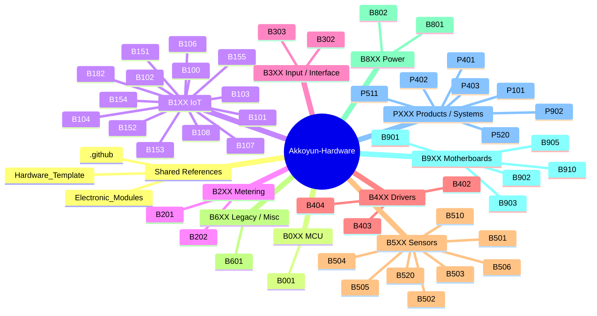

# Akkoyun Hardware

Open hardware organization for PCB design, embedded systems, modem boards, industrial interfaces, and production-ready electronics projects.

## Focus

This organization is used to keep hardware repositories systematic, reviewable, and maintainable over time.

Typical work in this space includes:

- PCB and schematic design
- Altium-based hardware development
- embedded and IoT hardware platforms
- modem and communication boards
- industrial interface and field electronics
- design-review and manufacturing documentation
- production handoff preparation

## What Lives Here

Repositories in this organization may represent:

- complete board designs
- hardware platform iterations
- communication and modem modules
- power, interface, or controller boards
- reference templates and shared standards
- supporting engineering documentation for validation and production

## Repository Standard

Hardware repositories in this organization are expected to follow the `Hardware_Template` structure.

Core layout:

- `Design Files/` — editable design source files
- `Documents/` — design notes, reviews, visuals, and validation records
- `Production/` — current curated manufacturing handoff package

Recommended output convention:

- `Design Files/Output/YYYY-MM-DD/`

Reference template:

- [`Hardware_Template`](https://github.com/Akkoyun-Hardware/Hardware_Template)

Naming and classification standard:

- [`KOD-STANDARTLARI.md`](./KOD-STANDARTLARI.md)
- Canonical source: <https://www.akkoyun.net/acik-kaynak/kod-standartlari/>

## Working Principles

- Keep source, documentation, and production outputs clearly separated.
- Preserve dated manufacturing and export snapshots when they matter.
- Keep `Production/` clean and manufacturer-facing.
- Avoid tracking generated junk such as preview, cache, and history artifacts.
- Prefer repeatable structure across all board repositories.
- Keep repositories understandable for both engineering review and production handoff.

## Notes

This organization is evolving into the main home for Akkoyun hardware design work.

## Repository Map

## 📚 Teknik Referanslar

- [PCB Technical References](./REFERENCES/PCB/README.md)

